# SwiftLift

SwiftLift is a user-friendly taxi booking app available on Android, iOS, and web platforms. It helps users quickly and
conveniently call a ride and travel safely to their destination.

## Table of Contents

- [Introduction](#introduction)
- [Features](#features)
- [How to Use the App](#how-to-use-the-app)
- [Technology Stack](#technology-stack)
- [Additional Information](#additional-information)

## Introduction

SwiftLift provides a simple user interface and various features that allow users to easily book a taxi anytime,
anywhere. The first screen displays the SwiftLift logo and name, followed by an introduction to the app's main features.

- 

Users can skip this introduction or proceed to the next step.

## Features

- **Account Creation and Login**

  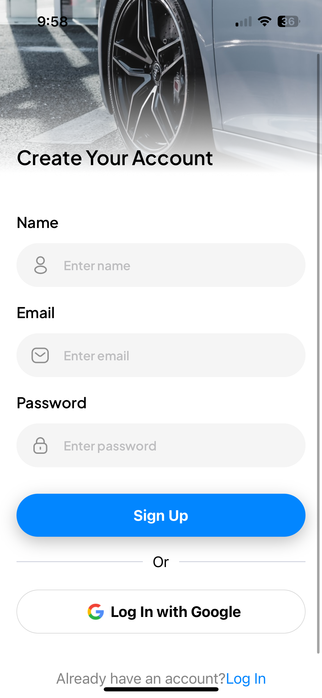
  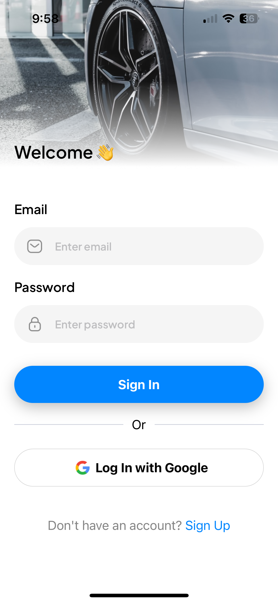
  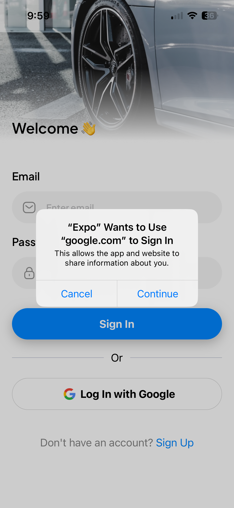

    - Users can create a new account by entering their name, email, and password.
    - Quick login is available using Google accounts.
    - Existing users can log in by entering their username and password.

- **Homepage**

  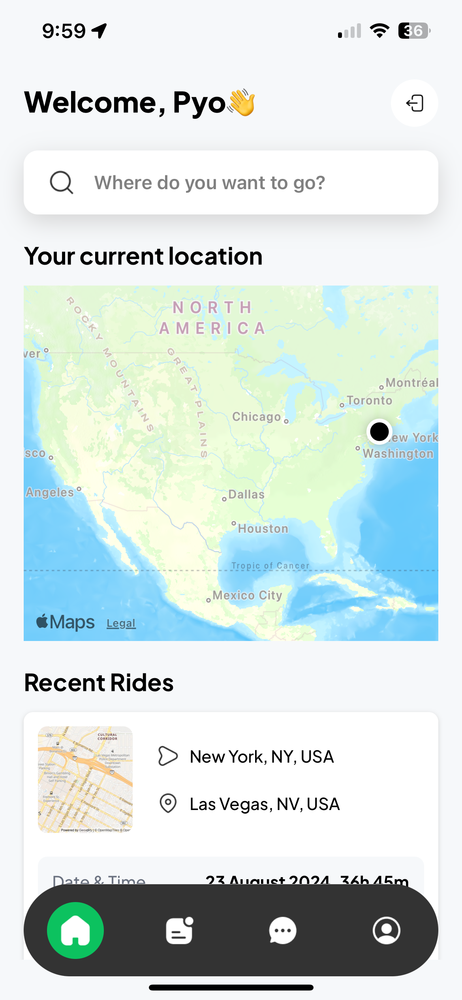
  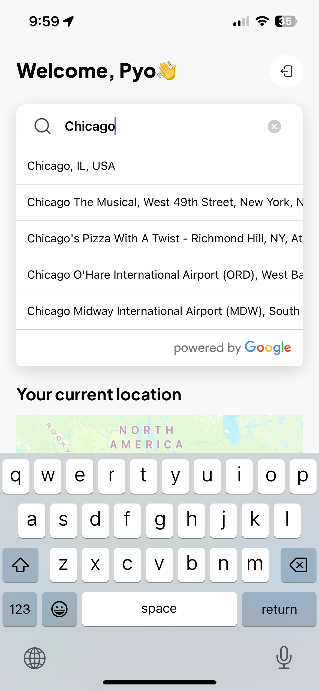

    - A search bar allows users to input their desired destination.
    - Users can view their current location on a map and check recent ride history.

- **Ride Booking**

  
  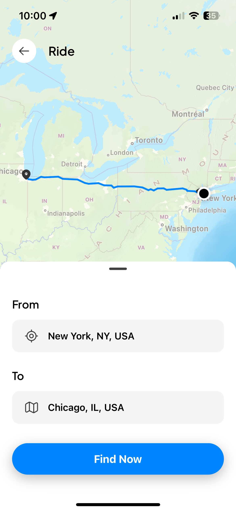
  
  
  
  

    - Users can set their pickup location (from) and destination (to).
    - Nearby riders can be searched, displaying their names, prices, estimated times, and seating capacity.
    - After selecting a rider, users can confirm their booking.

- **Payment and Confirmation**

  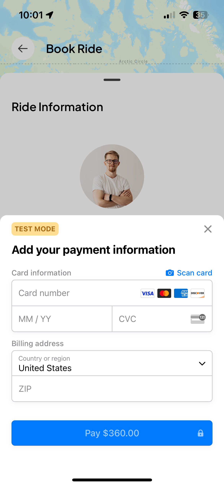
  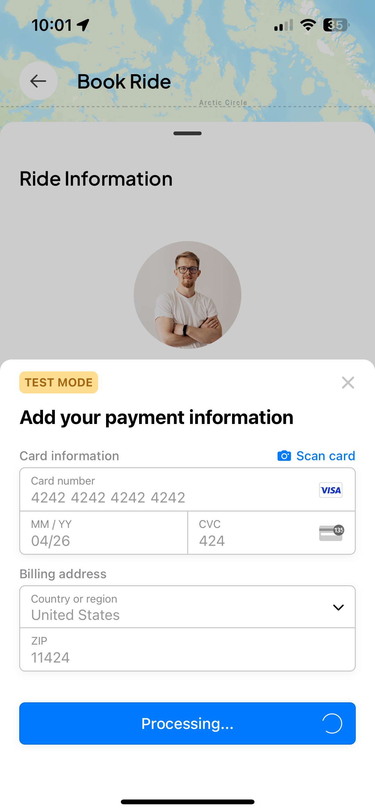
  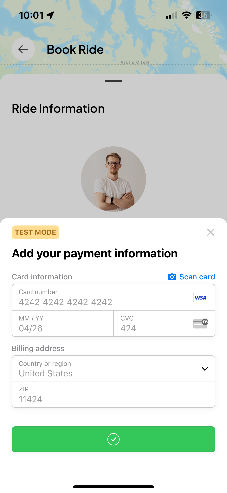
  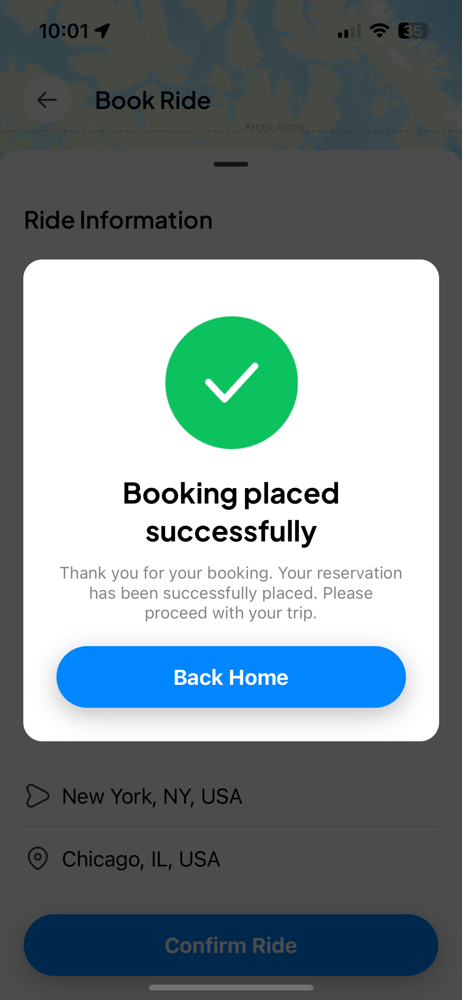
  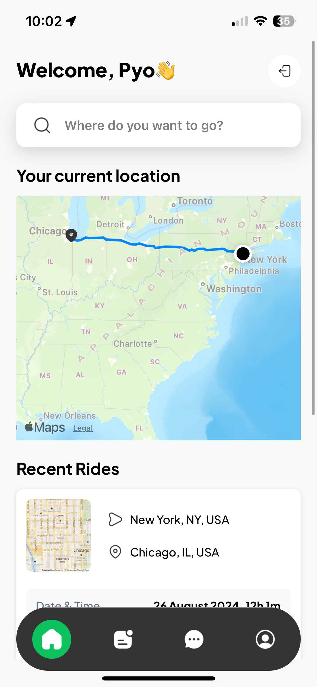

    - Users can enter their payment information and confirm the price before completing the booking.
    - After booking, users can view their recent rides.

- **Additional Features**

  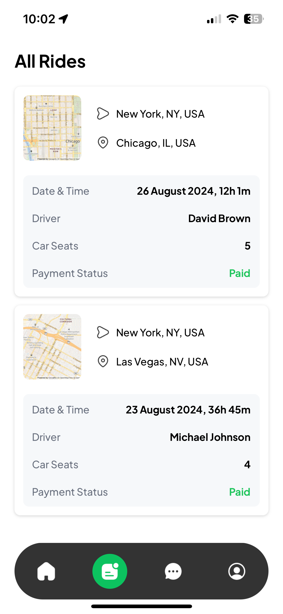
  
  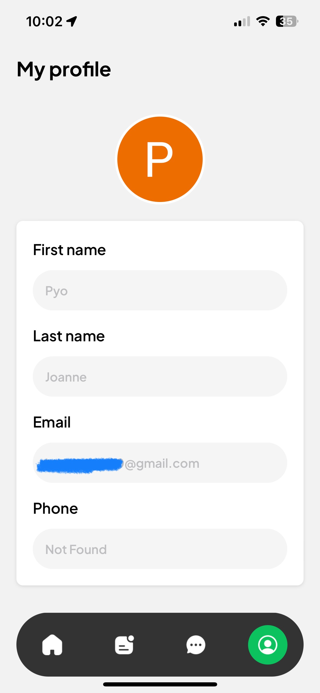

    - Users can view all ride information.
    - Chat history with drivers can be accessed.
    - Users can view and edit their profile information.

## Technology Stack

The SwiftLift app was developed using the following technology stack:

- **PostgreSQL**: Database management system
- **TypeScript**: A superset of JavaScript that provides type safety
- **Stripe**: Payment processing service
- **Tailwind CSS**: Utility-first CSS framework
- **Expo**: Tool for developing React Native apps
- **Clerk**: User authentication and management service
- **Neon**: Database hosting service
- **Geoapify**: Location-based services API
- **Google Cloud**: Cloud computing services
- **Adobe**: Design and prototyping tools

## How to Use the App

1. **Launch the App**: When you launch the SwiftLift app, the logo and name will be displayed.
2. **Skip or Proceed with Introduction**: Users can skip or proceed through the introduction by clicking 'Skip' or '
   Next'.
3. **Account Creation or Login**:
    - New Users: Select 'Create your Account' and enter the required information.
    - Existing Users: Select 'Login' to access their account.
4. **Homepage**: Use the search bar to enter the destination and check the current location.
5. **Ride Booking**: Set the pickup and destination locations, then search for nearby riders and select one.
6. **Payment and Confirmation**: Enter payment information and complete the booking.
7. **View Ride History**: Check recent rides under 'Recent Rides'.

## Getting Started

1. After downloading this document, navigate to the project directory and run `npm start`.
2. When the QR code appears, download and install Expo Go.
3. Use Expo Go to scan the QR code or run the app to explore the functionalities of SwiftLift.

## Additional Information

SwiftLift prioritizes user convenience and strives to provide a safe and reliable service. For any inquiries while using
the app, please contact our customer support team.

---

Experience safe and convenient travel with SwiftLift!
